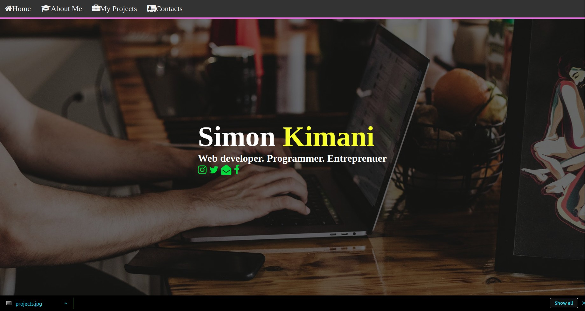

# Table of Contents

- Project Title
- Project Description
- Deployment
- Project Screenshot
- Technologies Used
- Acknowledgement
- Support and Contacts
- Licence
- Authors

# MY PORTFOLIO

## Description

- This portfolio was made to showcase the projects that i have done and the skill set i possess.
- It also gives a brief description of my hobbies and intersts.

## Deployment

- To visit the website click on the link (https://skimanikings.github.io/project2/).

## Project screenshots

 
- A screenshot to homepage of this project.

## Technologies Used

- The creation of the website was based on the following technologies 
    * HTML (Hyper Text Markup Language)
    * CSS (Cascading Styling Sheet)

## Acknoledgement 
- I would like to thank the following for their assistance through out this project. 
    * The Almighty God 
    * Angelo Kelvin (UI expert)
    * Paddington Mutuku (front-designer)

## Support & Contacts 
- Incase of any queries dont hesitate to reach out to me.
  *  kimanisimon856@gmail.com
  * 0713813919

 ## Licence
- The MIT License (MIT)

Copyright (c) 2019 Simon Kimani.

Permission is hereby granted, free of charge, to any person obtaining a copy of this software and associated documentation files (the "Software"), to deal in the Software without restriction, including without limitation the rights to use, copy, modify, merge, publish, distribute, sublicense, and/or sell copies of the Software, and to permit persons to whom the Software is furnished to do so, subject to the following conditions:

The above copyright notice and this permission notice shall be included in all copies or substantial portions of the Software.

THE SOFTWARE IS PROVIDED "AS IS", WITHOUT WARRANTY OF ANY KIND, EXPRESS OR IMPLIED, INCLUDING BUT NOT LIMITED TO THE WARRANTIES OF MERCHANTABILITY, FITNESS FOR A PARTICULAR PURPOSE AND NONINFRINGEMENT. IN NO EVENT SHALL THE AUTHORS OR COPYRIGHT HOLDERS BE LIABLE FOR ANY CLAIM, DAMAGES OR OTHER LIABILITY, WHETHER IN AN ACTION OF CONTRACT, TORT OR OTHERWISE, ARISING FROM, OUT OF OR IN CONNECTION WITH THE SOFTWARE OR THE USE OR OTHER DEALINGS IN THE SOFTWARE.

@SkimaniKings
 
## Author 
* Designed by **Simon Kimani**

